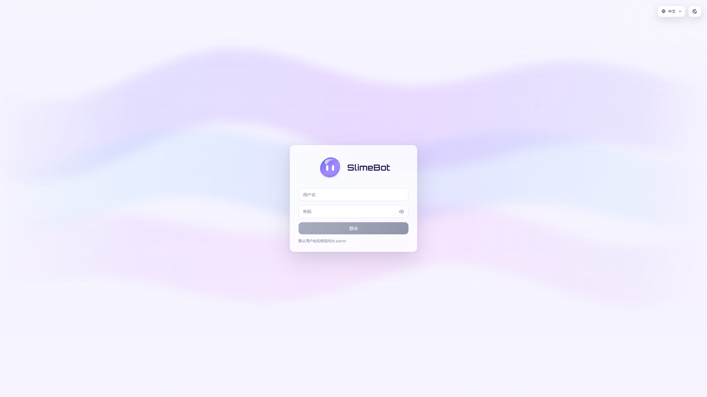
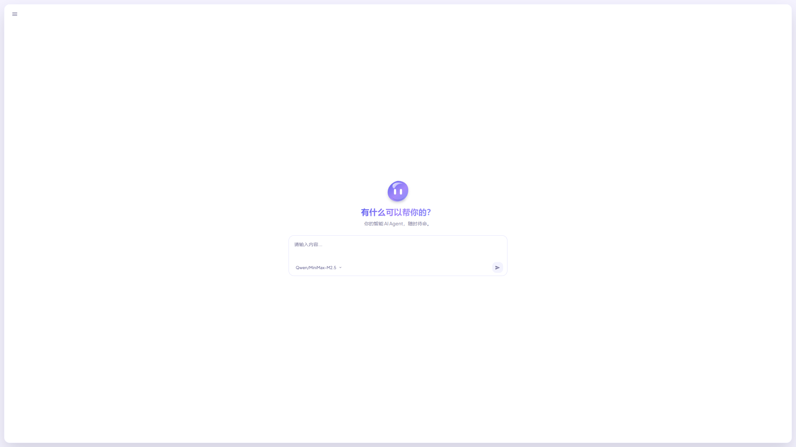
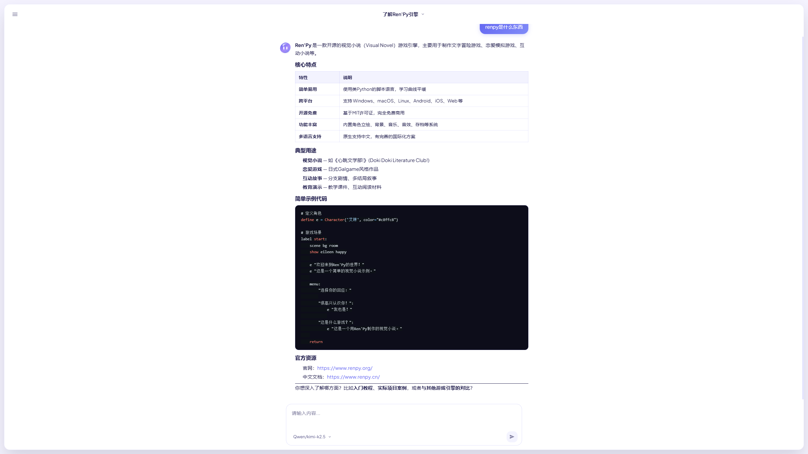
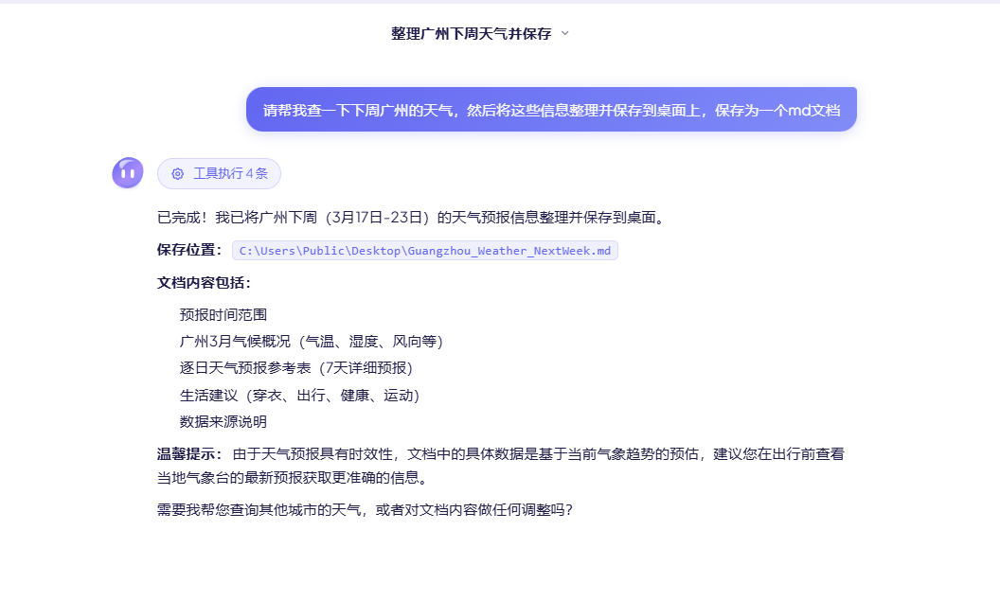
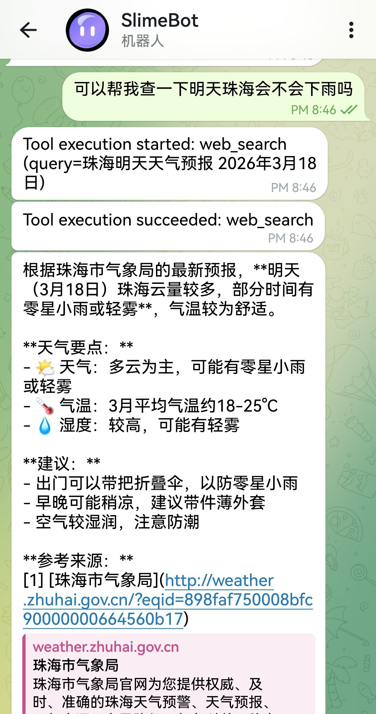

<p align="center">
  
</p>

这是一个个人练手的 Agent Demo 项目，目标是实现可持续扩展的 AI 会话应用雏形。

## 1. 当前支持功能

- 会话与消息
  - 会话列表、创建、重命名、删除
  - 按会话拉取历史消息
  - 基于 WebSocket 的实时流式回复（start/chunk/done）
  - 会话标题自动生成与更新推送
  - 多模态能力
- 工具与 Agent
  - Agent 多轮 tool call 执行链路
  - 工具调用审批机制（高风险工具需前端确认）
  - 工具结果写入会话历史并支持详情查看
  - 内置工具：`exec`、`http_request`、`web_search`（Tavily）
- 记忆能力
  - 会话摘要自动更新
  - 长会话上下文压缩与最近消息回补
  - 跨会话记忆检索并注入提示词上下文
- 配置与扩展
  - LLM 配置管理（增/删/列）
  - MCP 配置管理（增/改/删/启停）与工具加载
  - Skills 上传安装、列表、删除与运行时激活
- 消息平台（当前支持 Telegram）
  - 消息平台配置管理（新增、更新、启用/停用）
  - 平台消息接入与回复

## 2. UI 预览

### 登录页



### 主页



### 会话页



### 工具执行



### 消息平台（Telegram）



## 3. 架构与技术栈

### 架构说明

- 生产：Go 进程同时提供 REST/WebSocket 与嵌入的前端静态资源（`web/dist`）
- 开发：`npm run dev` 同时启动 Go 与 Vite，Vite 将 `/api`、`/ws` 代理到 `8080`
- 后端通过服务层访问模型接口，并将数据持久化到 SQLite
- 记忆检索采用混合策略：优先向量检索，失败时自动回退关键词检索

### 技术栈

- 前端：Vue 3
- 后端：Go
- 记忆向量化：ONNX Runtime + Qdrant存储 + bge-m3模型

## 4. 如何启动

> 默认端口：后端 `8080`，Vite `5173`

在项目根目录：

```powershell
npm install
npm install --prefix frontend
Copy-Item .env.example .env
Copy-Item frontend\.env.example frontend\.env
npm run dev
```

生产构建（根目录生成嵌入前端的 `slimebot` 可执行文件）：

```bash
npm run build
```

单独运行已构建的后端（仅提供 API + 静态页）：

```bash
go run ./cmd/server/main.go
```

## 5. 记忆向量化准备（bge-m3）

### Python 依赖安装

> 说明：记忆向量化需要本地 Python 环境安装依赖，用于执行 ONNX embedding。

```shell
pip install numpy onnxruntime transformers
```

### bge-m3 模型下载与文件准备

- 模型：`bge-m3`（ONNX 版本）
- 下载地址：[BAAI/bge-m3 ONNX](https://huggingface.co/BAAI/bge-m3/tree/main/onnx)
- 请将以下关键文件放到 `onnx/`（或你自定义的路径）：
  - `model.onnx`
  - `model.onnx_data`
  - `tokenizer.json`
- 如使用默认配置，目录结构示例：

```text
onnx/
  model.onnx
  model.onnx_data
  tokenizer.json
```

## 6. 配置文件使用方法

### 后端配置：项目根目录 `.env`

后端启动时会读取环境变量：

- `SERVER_PORT`：服务端口，默认 `8080`
- `DB_PATH`：SQLite 文件路径，默认 `./storage/data.db`
- `FRONTEND_ORIGIN`：与 Vite 联调时设为 `http://localhost:5173`；生产同源可留空
- `WEB_SEARCH_API_KEY`：Tavily 网络搜索 API Key
- `JWT_SECRET`：JWT 签名密钥（必填，未配置将启动失败）
- `JWT_EXPIRE`：JWT 过期时间（单位：分钟，默认 `21600` 即 15 天）
- `EMBEDDING_PROVIDER`：embedding 提供方式，默认 `onnx`
- `EMBEDDING_MODEL_PATH`：ONNX 模型路径，默认 `./onnx/model.onnx`
- `EMBEDDING_TOKENIZER_PATH`：tokenizer 路径，默认 `./onnx/tokenizer.json`
- `EMBEDDING_PYTHON_BIN`：Python 可执行程序，默认 `python`
- `EMBEDDING_SCRIPT_PATH`：embedding 脚本路径，默认 `./scripts/onnx_embed_server.py`
- `EMBEDDING_TIMEOUT_MS`：embedding 超时毫秒数，默认 `30000`
- `QDRANT_URL`：Qdrant gRPC 地址，默认 `127.0.0.1:6334`
- `QDRANT_COLLECTION`：向量集合名，默认 `session_memories`
- `MEMORY_VECTOR_TOPK`：向量检索返回条数，默认 `5`

> 注意：上述相对路径均以项目根目录作为启动工作目录。

示例：

```env
SERVER_PORT=8080
DB_PATH=./storage/data.db
FRONTEND_ORIGIN=http://localhost:5173
JWT_SECRET=CHANGE_ME_TO_A_RANDOM_SECRET
JWT_EXPIRE=21600
EMBEDDING_PROVIDER=onnx
EMBEDDING_MODEL_PATH=./onnx/model.onnx
EMBEDDING_TOKENIZER_PATH=./onnx/tokenizer.json
EMBEDDING_PYTHON_BIN=python
EMBEDDING_SCRIPT_PATH=./scripts/onnx_embed_server.py
EMBEDDING_TIMEOUT_MS=30000
QDRANT_URL=127.0.0.1:6334
QDRANT_COLLECTION=session_memories
MEMORY_VECTOR_TOPK=5
```

### 前端配置：`frontend/.env`

- `VITE_API_BASE_URL`：后端 HTTP 地址（例如 `http://localhost:8080`）
- `VITE_WS_URL`：后端 WebSocket 地址（例如 `ws://localhost:8080`）

示例：

```env
VITE_API_BASE_URL=http://localhost:8080
VITE_WS_URL=ws://localhost:8080
```

### 启用条件与降级行为

以下任一情况出现时，记忆能力会自动降级为关键词检索：

- `EMBEDDING_PROVIDER` 不是 `onnx`
- `EMBEDDING_MODEL_PATH` 或 `EMBEDDING_TOKENIZER_PATH` 缺失
- `QDRANT_URL` 或 `QDRANT_COLLECTION` 缺失
- 向量库初始化失败（例如 Qdrant 不可用）

## 7. 功能状态与待办

### 已完成

- 会话管理与消息流式回复（WebSocket）
- Agent 工具调用与审批流程
  - `exec`：系统命令行执行器
  - `http_request`：HTTP 请求器
  - `web_search`：基于 Tavily 的网络搜索器
- MCP 配置与工具执行能力
- Skills 包管理与运行时激活
- 会话持久化记忆与主动检索
- 消息平台基础能力（当前支持 Telegram）
- 多模态支持
- 记忆向量化存储与检索

### 待完成功能

- 更多消息平台接入（如Discord、Slack 等）
