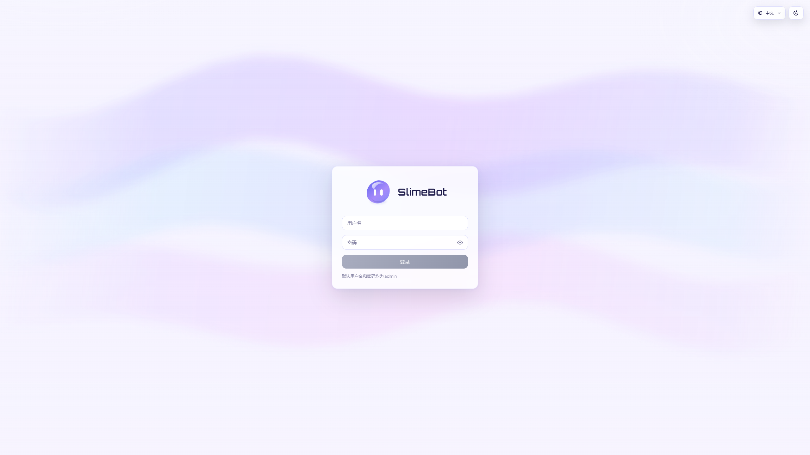
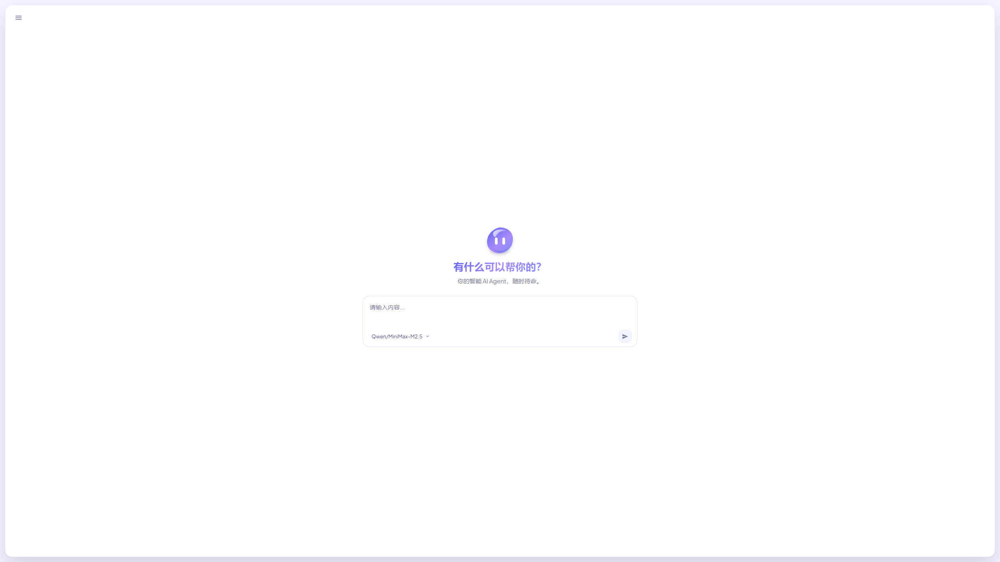
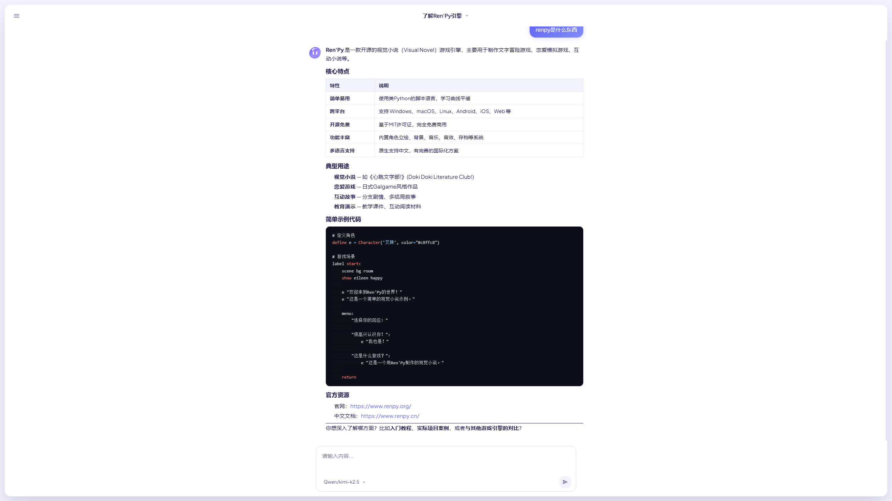
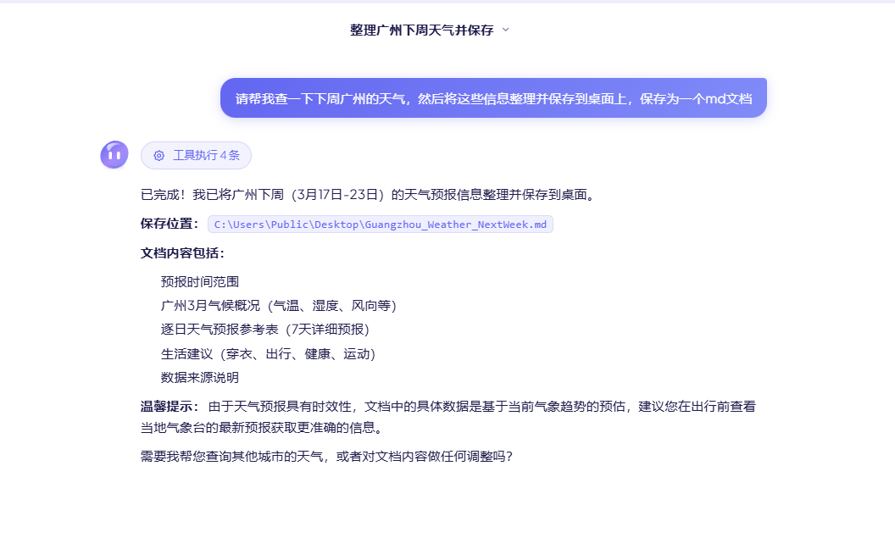
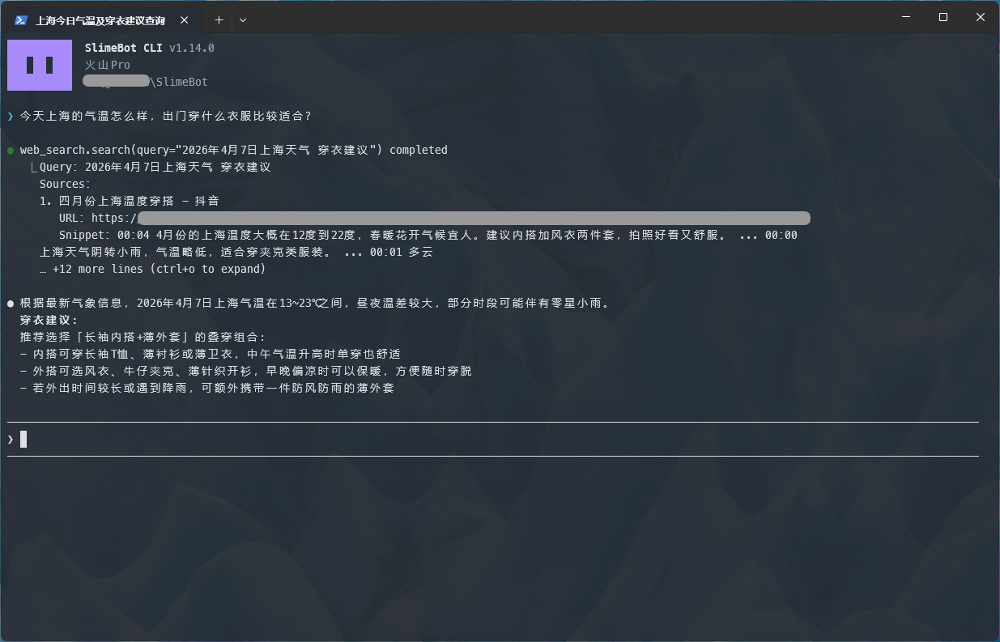

<p align="center">
  
  <br /><br />
  <strong>English</strong> | <a href="README.zh-CN.md">简体中文</a>
</p>

# SlimeBot

A personal AI agent demo: an extensible foundation for conversational AI apps. It ships with a **Go** backend, a **Vue 3** web UI, and a **React + Ink** terminal CLI.

## Features

- Chat sessions, real-time streaming replies, multimodal messages, and automatic title generation
- Agent tool-call flows with approval modes, sandbox policies, command/file tools, web requests, web search, and task tracking
- Desktop Computer Use on macOS, Windows, and Linux: inspect the foreground app through accessibility or screenshots, then click, type, press keys, and scroll on the machine running SlimeBot, subject to tool approval ([requirements and limits, in Chinese](docs/computer-use.zh-CN.md))
- Plan mode, streamed thinking, context compression, MCP configuration, skills, and AGENTS.md instructions
- Web UI, CLI TUI, and Telegram integration
- macOS and Windows desktop preview: no password login, background work continues after closing the window, and the tray menu provides Quit

## Desktop Preview (1.32.0)

The [`dev/1.32.0` Desktop preview workflow](https://github.com/natsuz0ra/SlimeBot/actions/workflows/desktop-preview.yml) produces `SlimeBot-1.32.0-macos-universal.dmg` and `SlimeBot-1.32.0-windows-x64.exe`, each available as a direct download from a [GitHub prerelease](https://github.com/natsuz0ra/SlimeBot/releases). After the branch is merged and `v1.32.0` is published, CI attaches both files directly to the same stable Release. On macOS, open the DMG and drag the `.app` into Applications; on Windows, run the EXE installer.

Desktop reads the same configuration as Web/CLI (`~/.slimebot/config.cfg` by default, or the directory set by `SLIMEBOT_HOME`) and honors its data paths. It uses an ephemeral local session, so no account password is needed; the script-installed Web service still uses password login. Do not run Desktop and the Web service simultaneously with the same data paths: both can start message platforms and scheduled tasks. Closing the desktop window keeps those tasks running; right-click the tray icon and choose **Quit SlimeBot** to stop them. Settings can check for releases and open the installer download page. These previews are unsigned, so the OS may require explicit permission on first launch. Installing an update currently requires downloading the new installer; macOS in-app automatic installation also requires signing and a ZIP update asset, which this DMG-only release does not provide. See the [technical design](docs/desktop-app-1.32.0-technical-design.zh-CN.md).

## Install From Release

Install the latest Release with one command:

macOS / Linux:

```bash
curl -fsSL https://github.com/natsuz0ra/SlimeBot/releases/latest/download/install.sh | sh
```

Windows PowerShell:

```powershell
irm https://github.com/natsuz0ra/SlimeBot/releases/latest/download/install.ps1 | iex
```

You can also download the archive for your system from the project releases, extract it, then run `./install.sh` or `.\install.ps1` from the extracted directory.

The installer downloads the matching package when needed, places SlimeBot under a user-local directory, and creates command shims. If your shell cannot find `slimebot`, add the shim directory printed by the installer to `PATH`.

Before running the Web service, edit `~/.slimebot/config.cfg` and set a strong `JWT_SECRET`.

## Update

SlimeBot can check GitHub Releases and apply updates from the installed command:

```bash
slimebot update --check          # check latest stable Release
slimebot update                  # update to latest stable Release
slimebot update --version v1.26.3
```

The update source follows the installer: `SLIMEBOT_REPO` first, otherwise `natsuz0ra/SlimeBot`. Web users can open **Settings -> About** for the update center, and CLI TUI users can run `/update`.

If the running build is `dev`, empty, or cannot be parsed as a version, automatic latest updates are disabled by default. Use `slimebot update --version vX.Y.Z` when you intentionally want to install a specific Release.

## Uninstall

Run the uninstaller from the latest Release with one command, or run it from the extracted Release directory or installed copy.

macOS / Linux:

```bash
curl -fsSL https://github.com/natsuz0ra/SlimeBot/releases/latest/download/uninstall.sh | sh
./uninstall.sh
```

Windows PowerShell:

```powershell
irm https://github.com/natsuz0ra/SlimeBot/releases/latest/download/uninstall.ps1 | iex
.\uninstall.ps1
```

The uninstaller stops and removes the user service, deletes the installed program files, and removes command shims. It asks before deleting `~/.slimebot` user data. Use `--purge` / `-Purge` to delete user data non-interactively, or `--yes` / `-Yes` to uninstall non-interactively while keeping user data.

Pass options to the remote script:

```bash
curl -fsSL https://github.com/natsuz0ra/SlimeBot/releases/latest/download/uninstall.sh | sh -s -- --yes
curl -fsSL https://github.com/natsuz0ra/SlimeBot/releases/latest/download/uninstall.sh | sh -s -- --purge
```

```powershell
& ([scriptblock]::Create((irm https://github.com/natsuz0ra/SlimeBot/releases/latest/download/uninstall.ps1))) -Yes
& ([scriptblock]::Create((irm https://github.com/natsuz0ra/SlimeBot/releases/latest/download/uninstall.ps1))) -Purge
```

## Commands

```bash
slimebot                         # start the CLI TUI
slimebot server                  # start the Web service in the foreground
slimebot service install         # install the Web service
slimebot service start           # start the Web service
slimebot service stop            # stop the Web service
slimebot service restart         # restart the Web service
slimebot service status          # show Web service status
slimebot service uninstall       # uninstall the Web service
slimebot update --check          # check for updates
slimebot update                  # apply latest stable update
slimebot update --version vX.Y.Z # apply a specific Release tag
slimebot version                 # show version information
slimebot help                    # show command help
```

Default Web port: **6247**. After the service starts, open `http://localhost:6247`.

Service commands install a current-user service by default. On macOS this uses `~/Library/LaunchAgents`; on Linux with systemd this uses `systemctl --user`, which requires a working user service session.

On macOS the service label is `com.natsuzora.slimebot`, the plist is `~/Library/LaunchAgents/com.natsuzora.slimebot.plist`, and logs are written to `~/.slimebot/log/service.out.log` and `~/.slimebot/log/service.err.log`. If `slimebot service start` reports that the legacy `slimebot` job is still loaded in launchd, run `launchctl bootout gui/$(id -u)/slimebot` first. If the legacy job came from a system LaunchDaemon, run `sudo launchctl bootout system /Library/LaunchDaemons/slimebot.plist`, then retry `slimebot service start`.

First-time Web login seeds a default account if no user exists yet: username **`admin`**, password **`admin`**. Change it immediately.

## Manual Source Deployment

For development startup, production builds from source, Docker, Docker Compose, configuration, sandbox notes, and data layout, see [Manual Deployment](docs/manual-deployment.md).

## Screenshots

### Sign-in



### Home



### Chat



### Plan mode


### Tool execution



### Telegram


### CLI



## Status & Roadmap

**Done:** Web/CLI chat, WebSocket streaming, agent tools, desktop Computer Use, approvals, sandbox enforcement, plan mode, thinking controls, subagents, MCP, skills, AGENTS.md instructions, SQLite-backed summaries, Telegram, multimodal chat, and JWT auth.

**Planned:** More messaging platforms such as Discord and Slack.

## License

This project is licensed under the [MIT License](LICENSE).
