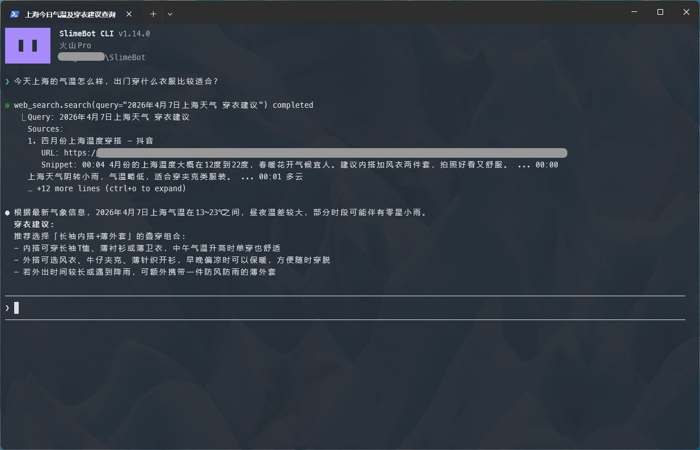

<p align="center">
  
  <br /><br />
  <a href="README.md">English</a> | <strong>简体中文</strong>
</p>

# SlimeBot

个人练手的 Agent Demo，目标是搭建可扩展的 AI 会话应用雏形。采用 **Go** 后端、**Vue 3** Web 前端，以及 **React + Ink** 终端 CLI。

## 当前支持功能

- **会话与消息**
  - 会话列表、创建、重命名、删除
  - 按会话拉取历史消息
  - 基于 WebSocket 的实时流式回复
  - 会话标题自动生成与更新推送
  - 多模态能力
- **工具与 Agent**
  - Agent 多轮 tool call 执行链路
  - 审批模式支持：**标准模式**（敏感工具需确认）与**自动执行**（直接执行）
  - 敏感内置工具需用户确认（当前为 `exec`），支持 Web、CLI、Telegram 等流程
  - 工具结果写入会话历史并支持详情查看
  - 内置工具：`命令行`、`网络请求`、`网络搜索`（Tavily）、`待办事项`
  - 支持面向代码编辑场景的文件读写能力，用于文本文件编辑场景
  - **子代理：**主 Agent 可将独立子任务交给内层 Agent，内层使用**隔离上下文**（不携带父会话聊天记录）。仅支持**一层嵌套**（子代理内不能再调用 `run_subagent`）。子代理内的工具调用在 Web 与 CLI 中**嵌套展示**在父工具之下；历史记录持久化 `parentToolCallId`，刷新会话后层级仍可还原。
- **规划与思考控制**
  - 规划模式（Plan Mode）：先产出计划，再审批后执行
  - 计划生命周期：生成、同意/拒绝、修改并重生成、审批后执行
  - 思考等级控制（`off` / `low` / `medium` / `high`）
  - Web 与 CLI 均支持思考流式事件展示与时间线呈现
- **记忆能力**
  - 按会话与模型配置保存隐藏压缩摘要
  - 上下文超出模型 `contextSize` 时自动压缩历史
  - Web 与 CLI 展示上下文用量和压缩状态
- **配置与扩展**
  - MCP 配置管理
  - Skills 上传安装、列表、删除与运行时激活
- **消息平台**（当前支持 Telegram）
  - 消息平台配置管理
  - 平台消息接入与回复
- **CLI TUI**
  - 独立 CLI（无头 Go 子进程 + Ink 终端界面），支持对话与基本配置

## UI 预览

### 登录页


### 主页


### 会话页


### 工具执行


### 消息平台（Telegram）


### CLI



## 架构与技术栈

- **生产**：Go 进程同时提供 REST/WebSocket，并通过 `go:embed` 嵌入 `web/dist` 静态资源，单一可执行文件交付。
- **开发**：`npm run dev` 同时启动 Go 与 Vite；Vite 将 `/api`、`/ws` 代理到 `8080`。
- **数据**：默认 SQLite，路径 `~/.slimebot/storage/data.db`，会话压缩摘要也持久化在其中。
- **记忆**：当前为会话内上下文压缩记忆。系统在需要时生成隐藏 `<context_summary>`，并与最新消息一起注入模型上下文。

**技术栈（概览）：** Go 后端 · Vue 3 Web 前端 · React + Ink CLI。

## 如何启动

默认端口：后端 **8080**，Vite **5173**。

在仓库根目录：

```bash
make deps
npm run dev
```

或手动安装依赖：

```bash
npm install
npm install --prefix frontend
npm run dev
```

首次启动会在缺失时创建 `~/.slimebot/.env`；后续若嵌入式模板新增键名，会按需追加到现有文件。

**首次登录（Web 服务模式）：** 若数据库中尚无用户，会种子一个默认账号（用户名 **`admin`**，密码 **`admin`**），并引导修改密码。除本机尝鲜外请尽快修改。

**生产构建**（生成嵌入前端的 `slimebot` 可执行文件）：

```bash
npm run build
# 或
make build
```

**仅运行后端**（需先完成前端构建以提供静态页）：

```bash
go run ./cmd/server/main.go
```

**CLI TUI：**

```bash
npm run cli
```

`make cli` 会安装 CLI 的 npm 依赖、构建 CLI（React + Ink）并生成 `slimebot-cli` 可执行文件（见 [Makefile](Makefile)）。

**测试：**

```bash
make test
# 或
go test ./...
```

**Docker：**

```bash
make docker-build
make docker-run
```

**Docker Compose：**

```bash
make compose-up
make compose-down
```

### CLI 内置命令

- `/new` 新建会话（懒创建，首次发送消息才真正建会话）
- `/session` 会话菜单（切换 / 删除）
- `/model` 模型菜单（切换全局默认模型）
- `/skills` 技能菜单（查看信息 / 删除）
- `/mcp` MCP 菜单（增删改查，内置多行编辑）
- `/mode` 切换审批模式（`standard` / `auto`）
- `/effort` 设置思考等级（`off` / `low` / `medium` / `high`）
- `/plan` 切换规划模式（`on` / `off`）
- `/help` 帮助

## 数据与资源目录（默认）

所有运行时数据默认集中在 `~/.slimebot`：

```text
~/.slimebot/
  .env
  skills/
  storage/
    data.db
    chat_uploads/
```

- `.env`：配置文件
- `storage/data.db`：SQLite 主数据库
- `storage/chat_uploads`：聊天附件
- `skills`：Skills 存储目录

## 记忆存储（工作机制）

- 记忆不是独立的 Markdown 文件或全文索引，而是存储在 SQLite 中的会话压缩摘要。
- 当完整历史、系统提示词、运行环境信息和工具回放估算后仍低于模型配置的 `contextSize` 时，会直接发送完整历史。
- 当上下文超过 `contextSize` 时，系统调用当前模型生成压缩摘要，写入 `session_context_summaries`，并在后续请求中以隐藏 `<context_summary>` 形式注入。
- 摘要按 `sessionId + modelConfigId` 区分；同一会话切换不同模型配置时会使用对应配置的摘要。
- 已有摘要可复用；如果摘要后的新消息再次超窗，会把旧摘要与新增消息滚动压缩成新的摘要。
- 压缩摘要仅作为同一会话的连续性上下文使用；如果与新的用户输入冲突，系统提示要求优先遵循新消息。
- 最新一条用户输入会被保护：若它单独就超过上下文窗口，会直接报错，提示缩短输入或调大上下文大小。
- Web 与 CLI 会通过 `context_usage` / `context_compacted` 事件展示已用 token、可用比例和是否已压缩。

## 配置文件（`~/.slimebot/.env`）

后端会读取下列变量（括号内为默认值或说明）：

- `SERVER_PORT`：服务端口，默认 `8080`
- `DB_PATH`：SQLite 文件路径，默认 `~/.slimebot/storage/data.db`
- `SKILLS_ROOT`：Skills 根目录，默认 `~/.slimebot/skills`
- `CHAT_UPLOAD_ROOT`：聊天附件目录，默认 `~/.slimebot/storage/chat_uploads`
- `CONTEXT_HISTORY_ROUNDS`：历史轮数配置保留项，默认 `20`，内部限制为 `5` 到 `50`
- `DEFAULT_CONTEXT_SIZE`：新建模型配置的默认上下文大小，默认 `1000000`
- `FRONTEND_ORIGIN`：与 Vite 联调时设为 `http://localhost:5173`；生产同源可留空
- `WEB_SEARCH_API_KEY`：Tavily API Key，供 `web_search` 使用
- `JWT_SECRET`：**服务端模式必填**，未配置将启动失败（CLI 无头模式可自动生成）
- `JWT_EXPIRE`：JWT 过期时间（单位：分钟，默认 `21600` 即约 15 天）
- `approvalMode`（应用设置）：`standard` 或 `auto`
- `thinkingLevel`（应用设置）：`off` / `low` / `medium` / `high`

首次启动生成的 `.env` 与嵌入式模板一致，见 [internal/runtime/env.template](internal/runtime/env.template)。其他键可按需自行追加。

示例：

```env
SERVER_PORT=8080
DB_PATH=~/.slimebot/storage/data.db
SKILLS_ROOT=~/.slimebot/skills
CHAT_UPLOAD_ROOT=~/.slimebot/storage/chat_uploads
WEB_SEARCH_API_KEY=YOUR_TAVILY_API_KEY
JWT_SECRET=CHANGE_ME_TO_A_RANDOM_SECRET
JWT_EXPIRE=21600

# CONTEXT_HISTORY_ROUNDS=20
# DEFAULT_CONTEXT_SIZE=1000000

# FRONTEND_ORIGIN=http://localhost:5173
```

### 前端配置：`frontend/.env`

- `VITE_API_BASE_URL`：后端 HTTP 地址（例如 `http://localhost:8080`）
- `VITE_WS_URL`：后端 WebSocket 地址（例如 `ws://localhost:8080`）

示例：

```env
VITE_API_BASE_URL=http://localhost:8080
VITE_WS_URL=ws://localhost:8080
```

## 功能状态与待办

### 已完成

- 会话管理与 WebSocket 流式回复（含错误、工具调用、子代理与思考事件）
- Agent 工具与审批（标准模式下 `exec` 需确认；支持可选自动审批模式）
- 规划模式：计划生成、同意/拒绝/修改流程，以及审批后执行
- 思考等级控制（`off` / `low` / `medium` / `high`）与流式思考展示
- 子代理 / 嵌套 Agent（`run_subagent`）、嵌套工具 UI，以及工具历史中的父子关联持久化
- MCP 与 Skills
- 基于 SQLite 的会话压缩摘要、上下文用量统计与隐藏上下文注入
- Telegram 集成
- 多模态支持
- JWT 认证与默认管理员种子

### 待完成功能

- 更多消息平台接入（如 Discord、Slack 等）

## 许可

本项目以 [MIT 许可证](LICENSE) 授权。
