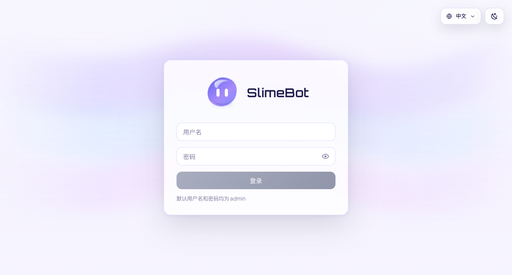
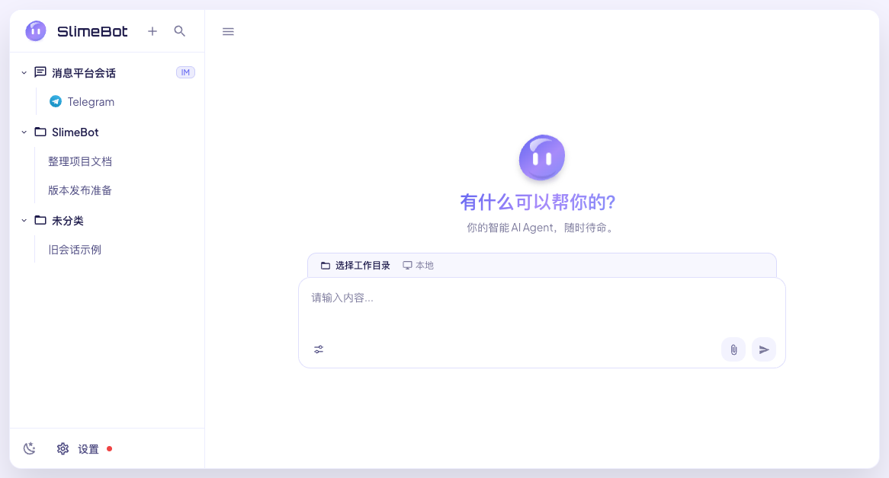
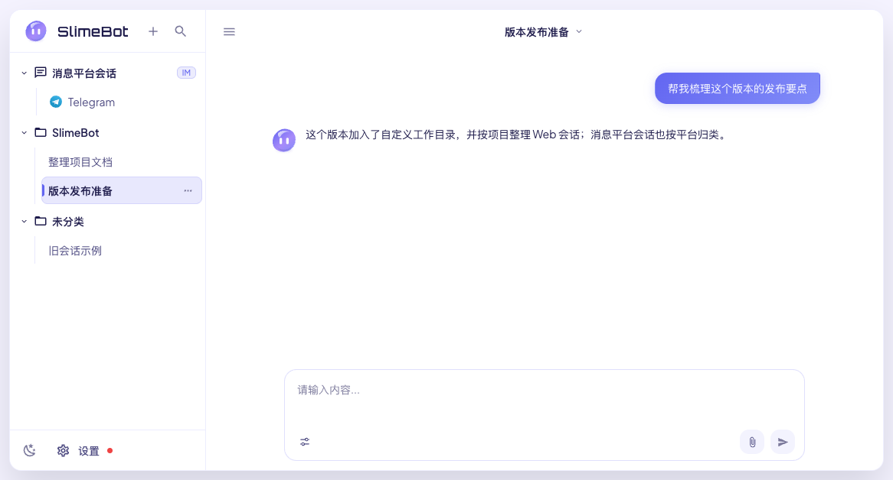

<p align="center">
  
  <br /><br />
  <a href="README.md">English</a> | <strong>简体中文</strong>
</p>

# SlimeBot

个人练手的 Agent Demo，目标是搭建可扩展的 AI 会话应用雏形。采用 **Go** 后端、**Vue 3** Web 前端，以及 **React + Ink** 终端 CLI。

## 当前支持功能

- 会话列表、实时流式回复、多模态消息、会话标题自动生成
- Agent 多轮 tool call、审批模式、沙盒策略、命令/文件工具、网络请求、网络搜索和待办事项
- 桌面 Computer Use：在 SlimeBot 所在机器的交互式桌面上，优先通过辅助功能识别前台应用，必要时结合截图完成点击、输入、按键和滚动；支持 macOS、Windows 和 Linux，操作遵循工具审批（[环境要求与使用限制](docs/computer-use.zh-CN.md)）
- 规划模式、流式思考、上下文压缩、MCP 配置、Skills 与 AGENTS.md 指令
- Web UI、CLI TUI 与 Telegram 集成
- Web 会话可在首次对话前选择工作目录，侧边栏按项目归类；旧会话归入“未分类”，消息平台会话按平台归类
- macOS / Windows 桌面应用预览版：免账号密码登录，关窗后继续运行后台任务，可从系统托盘退出

## 桌面应用（1.33.0）

[v1.33.0 正式 Release](https://github.com/natsuz0ra/SlimeBot/releases/tag/v1.33.0) 分别提供 `SlimeBot-1.33.0-macos-universal.dmg` 和 `SlimeBot-1.33.0-windows-x64.exe`，可直接下载独立文件。macOS 打开 DMG 后将 `.app` 拖到“应用程序”目录；Windows 直接运行 EXE 安装程序。Windows 安装时可选择是否创建桌面快捷方式，安装和卸载过程会显示操作明细。

桌面版与 Web/CLI 读取同一配置（默认 `~/.slimebot/config.cfg`，设置 `SLIMEBOT_HOME` 时从指定目录读取），并沿用其中的数据路径。桌面版使用随机本地会话，打开后无需输入账号密码；脚本安装的 Web 端仍保留账号密码登录。不要让桌面版与 Web 服务同时使用相同的数据路径，否则消息平台和计划任务可能重复运行。关闭窗口会隐藏到托盘，消息平台与计划任务继续运行；在托盘图标右键选择“退出 SlimeBot”才会停止后台服务。设置中的更新中心可检查新版本并打开下载页。当前预览包未签名，需按系统提示明确允许首次运行，更新时手动下载并覆盖安装。macOS 只发布 DMG，应用内自动安装还需要代码签名和 ZIP 更新包，暂不启用。详细方案见 [桌面应用技术方案](docs/desktop-app-1.32.0-technical-design.zh-CN.md)。

## 从 Release 安装

用一条命令安装最新 Release：

macOS / Linux：

```bash
curl -fsSL https://github.com/natsuz0ra/SlimeBot/releases/latest/download/install.sh | sh
```

Windows PowerShell：

```powershell
irm https://github.com/natsuz0ra/SlimeBot/releases/latest/download/install.ps1 | iex
```

也可以从项目 Release 下载适合当前系统的压缩包，解压后在解压目录执行 `./install.sh` 或 `.\install.ps1`。

安装脚本会在需要时自动下载匹配的压缩包，把 SlimeBot 放到用户本地目录，并创建命令入口。如果终端找不到 `slimebot`，请把安装脚本输出的 shim 目录加入 `PATH`。

启动 Web 服务前，请编辑 `~/.slimebot/config.cfg`，设置一个强随机的 `JWT_SECRET`。

## 更新

SlimeBot 可以通过已安装的命令检查 GitHub Release 并执行更新：

```bash
slimebot update --check          # 检查最新稳定 Release
slimebot update                  # 更新到最新稳定 Release
slimebot update --version v1.26.3
```

更新源沿用安装逻辑：优先读取 `SLIMEBOT_REPO`，否则使用 `natsuz0ra/SlimeBot`。Web 用户可在 **设置 -> 关于** 打开更新中心，CLI TUI 用户可输入 `/update`。

如果当前构建版本是 `dev`、空值，或无法解析为版本号，默认会禁用一键更新。确认要安装某个指定 Release 时，请使用 `slimebot update --version vX.Y.Z`。

## 卸载

用一条命令运行最新 Release 中的卸载脚本，或在解压后的 Release 目录、已安装目录中运行卸载脚本。

macOS / Linux：

```bash
curl -fsSL https://github.com/natsuz0ra/SlimeBot/releases/latest/download/uninstall.sh | sh
./uninstall.sh
```

Windows PowerShell：

```powershell
irm https://github.com/natsuz0ra/SlimeBot/releases/latest/download/uninstall.ps1 | iex
.\uninstall.ps1
```

卸载脚本会停止并卸载用户服务，删除程序安装目录和命令入口。删除 `~/.slimebot` 用户数据前会询问确认。使用 `--purge` / `-Purge` 可非交互删除用户数据，使用 `--yes` / `-Yes` 可非交互卸载但保留用户数据。

远程执行并传入参数：

```bash
curl -fsSL https://github.com/natsuz0ra/SlimeBot/releases/latest/download/uninstall.sh | sh -s -- --yes
curl -fsSL https://github.com/natsuz0ra/SlimeBot/releases/latest/download/uninstall.sh | sh -s -- --purge
```

```powershell
& ([scriptblock]::Create((irm https://github.com/natsuz0ra/SlimeBot/releases/latest/download/uninstall.ps1))) -Yes
& ([scriptblock]::Create((irm https://github.com/natsuz0ra/SlimeBot/releases/latest/download/uninstall.ps1))) -Purge
```

## 常用命令

```bash
slimebot                         # 启动 CLI TUI
slimebot cli                     # 显式启动 CLI TUI
slimebot server                  # 前台启动 Web 服务
slimebot service install         # 安装 Web 用户服务
slimebot service start           # 启动 Web 用户服务
slimebot service stop            # 停止 Web 用户服务
slimebot service restart         # 重启 Web 用户服务
slimebot service status          # 查看 Web 用户服务状态
slimebot service uninstall       # 卸载 Web 用户服务
slimebot update --check          # 检查更新
slimebot update                  # 应用最新稳定更新
slimebot version                 # 输出版本信息
slimebot help                    # 显示命令帮助
```

Web 默认端口为 **6247**。服务启动后访问 `http://localhost:6247`。

服务命令默认安装当前用户服务。macOS 使用 `~/Library/LaunchAgents`；Linux systemd 使用 `systemctl --user`，需要可用的用户服务会话。

macOS 服务 label 为 `com.natsuzora.slimebot`，plist 位于 `~/Library/LaunchAgents/com.natsuzora.slimebot.plist`，日志位于 `~/.slimebot/log/service.out.log` 和 `~/.slimebot/log/service.err.log`。如果 `slimebot service start` 提示旧版 `slimebot` 服务仍在 launchd 中，先运行 `launchctl bootout gui/$(id -u)/slimebot`；如果旧服务来自系统级 LaunchDaemon，再运行 `sudo launchctl bootout system /Library/LaunchDaemons/slimebot.plist`，然后重新执行 `slimebot service start`。

首次 Web 登录时，若数据库中尚无用户，会种子默认账号：用户名 **`admin`**，密码 **`admin`**。请立即修改。

## 手动源码部署

开发启动、源码生产构建、Docker、Docker Compose、配置文件、沙盒说明和数据目录见 [手动源码部署](docs/manual-deployment.zh-CN.md)。

## UI 预览

以下截图取自 1.33.0 版本，使用示例数据。

### 登录页



### 新对话与工作目录



### 会话与项目侧边栏



## 功能状态与待办

**已完成：** Web/CLI 会话、WebSocket 流式回复、Agent 工具、桌面 Computer Use、审批、沙盒约束、规划模式、思考控制、子代理、MCP、Skills、AGENTS.md 指令、SQLite 摘要、Telegram、多模态与 JWT 认证。

**待完成：** 更多消息平台接入，如 Discord、Slack 等。

## 许可

本项目以 [MIT 许可证](LICENSE) 授权。
